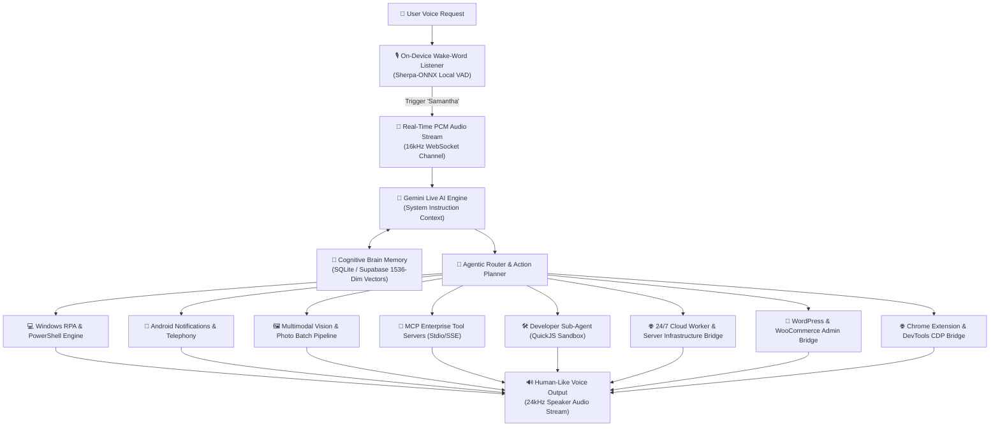

# 🎙️ Samantha AI - Autonomous Cognitive Voice, Vision & Device Assistant

> **Samantha AI** is designed as a persistent cognitive companion that unifies natural conversation, multimodal perception, long-term memory, and autonomous interaction with the user's digital environment across Windows Desktop, Android, and iOS.

---

### 🌟 Executive Architecture Summary

> **Samantha AI combines ten traditionally separate AI systems into a single unified runtime platform:**
> 1. 🎙️ **Real-Time Voice Assistant** *(Bidirectional Gemini Live & Sherpa-ONNX Local VAD)*
> 2. 💻 **Desktop Workstation Automation** *(Windows Visual RPA, Screen Taps & PowerShell)*
> 3. 📱 **Mobile Background Automation** *(Android Notification Direct Reply, Telephony & Overlays)*
> 4. 🖼️ **Multimodal Vision AI** *(Automated Screen Inspection & 3,000+ Photo Batch Organizer)*
> 5. 🧠 **Cognitive Brain & Relationship Memory** *(Local-First SQLite & Supabase 1536-Dim Vector Embeddings)*
> 6. 🔌 **Model Context Protocol (MCP)** *(Open Stdio & SSE Enterprise Tool Servers)*
> 7. 🛠️ **Self-Improving Developer Sub-Agent** *(On-The-Fly Skill Creation & QuickJS Sandbox)*
> 8. 🌐 **Agent Client-Server Split & 24/7 Cloud Worker** *(Hostinger VPS, Docker Daemon & Remote Execution)*
> 9. 🛒 **Autonomous WordPress & E-Commerce Site Management** *(Full Admin Control, Publishing, Products & Analytics)*
> 10. 🌐 **Google Chrome Extension & DevTools Browser Automation** *(DOM Automation, Console Debugging & Network Inspection)*

---

## 🧱 Unified Multi-System Architecture (All-In-One Platform)

Unlike single-purpose AI tools that focus on only one narrow capability (e.g., chat-only models, browser-only extensions, or CLI-only coding bots), **Samantha AI** operates as a **Unified Multi-System Autonomous Platform**:

```mermaid
graph TD
    A["🎙️ Real-Time Voice Engine<br/>(Gemini Live & Sherpa VAD)"] --> S["🧠 Samantha AI Core Engine"]
    B["💻 Desktop Visual RPA & PowerShell<br/>(Windows Workstation)"] --> S
    C["📱 Mobile Background Automation<br/>(Android Notification & Calls)"] --> S
    D["🖼️ Multimodal Vision AI<br/>(Photo Batch & Screen Inspector)"] --> S
    E["🔌 Model Context Protocol (MCP)<br/>(Stdio & SSE Enterprise Tools)"] --> S
    F["🛠️ Self-Improving Developer Agent<br/>(Dynamic Skill & JS Tool Creation)"] --> S
    G["💾 Cognitive Memory & Vector DB<br/>(SQLite Local-First & Supabase)"] --> S
    H["🌐 Agent Client-Server Split & 24/7 Worker<br/>(VPS, Hostinger Docker & Server Daemon)"] --> S
    I["🛒 WordPress & E-Commerce Site Bridge<br/>(Full Admin Panel, Products & Content)"] --> S
    J["🌐 Google Chrome Extension & DevTools<br/>(DOM, Console & Network Inspection)"] --> S
```

---

## ⚡ Runtime Execution Pipeline (How Samantha Works)

Below is the high-level data and action execution pipeline showing how Samantha processes user requests from initial voice wake to native device execution:

---

## 📑 Table of Contents
- [🧱 Unified Multi-System Architecture (All-In-One Platform)](#-unified-multi-system-architecture-all-in-one-platform)
- [⚡ Runtime Execution Pipeline (How Samantha Works)](#-runtime-execution-pipeline-how-samantha-works)
- [🎯 Design Philosophy](#-design-philosophy)
- [🏆 Key Product Differentiators & Industry Capability Comparison](#-key-product-differentiators--industry-capability-comparison)
- [✨ Product Capabilities & Feature Showcase](#-product-capabilities--feature-showcase)
  - [1. 🎙️ Hands-Free Real-Time Voice & Audio Intelligence](#1-️-hands-free-real-time-voice--audio-intelligence)
  - [2. 💻 Autonomous PC Workstation Automation (Windows)](#2--autonomous-pc-workstation-automation-windows)
  - [3. 📱 Smartphone Automation & Notification Assistant (Android)](#3--smartphone-automation--notification-assistant-android)
  - [4. 🖼️ AI Vision & Smart Photo/File Content Organizer](#4-️-ai-vision--smart-photofile-content-organizer)
  - [5. 🧠 Cognitive Memory & Relationship Intelligence](#5--cognitive-memory--relationship-intelligence)
  - [6. 🔌 Model Context Protocol (MCP) & Self-Improving Developer Agent](#6--model-context-protocol-mcp--self-improving-developer-agent)
  - [7. 🌐 Agent Client-Server Split & 24/7 Cloud Worker](#7--agent-client-server-split--247-cloud-worker)
  - [8. 🎨 Premium Futuristic UI & Haptic Experience](#8--premium-futuristic-ui--haptic-experience)
  - [9. 🛒 Autonomous WordPress & E-Commerce Site Management](#9--autonomous-wordpress--e-commerce-site-management)
  - [10. 🌐 Google Chrome Extension & DevTools Browser Automation](#10--google-chrome-extension--devtools-browser-automation)
  - [11. 🌐 Global Localization & Custom Persona](#11--global-localization--custom-persona)
- [📺 Application Screen Inventory](#-application-screen-inventory)
- [🔑 Platform Permissions & Graceful Security](#-platform-permissions--graceful-security)
- [❓ Frequently Asked Questions (FAQ) / ხშირად დასმული შეკითხვები](#-frequently-asked-questions-faq--ხშირად-დასმული-შეკითხვები)
- [🚀 Quick Start & Operating Requirements](#-quick-start--operating-requirements)
- [🔒 Privacy & Data Sovereignty](#-privacy--data-sovereignty)

---

## 🎯 Design Philosophy

Rather than specializing in a single domain, **Samantha AI** is designed as a persistent cognitive companion that unifies natural conversation, multimodal perception, long-term memory, and autonomous interaction with the user's digital environment.

---

## 🏆 Key Product Differentiators & Industry Capability Comparison

Below is a capability comparison matrix highlighting **Samantha AI**'s architectural differentiators compared to traditional product categories in the AI ecosystem:

| Product Differentiator | 🎙️ **Samantha AI** | 🤖 Cloud Voice Apps | 📱 OS Voice Assistants | 🐾 CLI / Terminal Agents |
| :--- | :---: | :---: | :---: | :---: |
| **Real-Time Streaming Voice Engine** | ✅ Native Gemini Live | ✅ Supported | ⚠️ Turn-based latency | ❌ CLI/Text only |
| **Local Offline Wake-Word Detection** | ✅ On-Device ("Samantha") | ❌ Requires app open | ✅ Native Wake-Word | ❌ None |
| **Windows Desktop Visual RPA & PowerShell** | ✅ Full OS & Visual Taps | ❌ None | ❌ None | ⚠️ Terminal/Code only |
| **Android Background Notification Reply** | ✅ Inline Direct Reply | ❌ None | ⚠️ Limited SMS | ❌ None |
| **Bulk AI Photo & Folder Organization** | ✅ Auto Folder Creation & Move | ❌ Single upload only | ⚠️ Gallery Search only | ⚠️ Manual Scripting |
| **Agent Client-Server Split (24/7 Cloud Worker)** | ✅ Hostinger Docker + App Actuator | ❌ None | ❌ None | ⚠️ Server CLI only |
| **Autonomous WordPress Site & Admin Control** | ✅ Full Admin, Publishing & Products | ❌ None | ❌ None | ❌ None |
| **Google Chrome Extension & DevTools Control** | ✅ DOM, Console & Network Inspection | ❌ None | ❌ None | ⚠️ Basic Puppeteer |
| **Autonomous Self-Improving Skill Creation** | ✅ JIT JS Plugin Generation | ❌ None | ❌ None | ⚠️ Code execution |
| **Continuous Adaptive Personality Learning** | ✅ 3-Tier Cognitive Distillation | ❌ Session context only | ⚠️ Basic preferences | ⚠️ Local text memory |
| **Model Context Protocol (MCP) Standard** | ✅ Open Stdio & SSE Standard | ❌ Proprietary | ❌ None | ⚠️ Custom Schemas |
| **Privacy-First On-Device SQLite Storage** | ✅ Zero-Cloud Mandate | ❌ Cloud storage only | ⚠️ Hybrid storage | ⚠️ Local text files |
| **Relationship & People Memory System** | ✅ Family, Friends & Social Graph | ❌ None | ⚠️ Basic Contacts | ❌ None |
| **Biometric Voice Enrollment Locking** | ✅ Owner Voice Verification | ❌ None | ✅ Voice Match | ❌ None |
| **1-Click State & Memory Migration** | ✅ Plain JSON Export/Import | ❌ None | ❌ None | ❌ None |

---

## ✨ Product Capabilities & Feature Showcase

### 1. 🎙️ Hands-Free Real-Time Voice & Audio Intelligence
* **Local Offline Wake Word ("Samantha"):** Detects the wake phrase *"Samantha"* on-device in real-time without sending audio data to the cloud until activated.
* **Speaker Verification & Owner Locking:** Supports enrolling your personal voice profile so Samantha responds strictly to her owner and ignores background chatter.
* **Ultra-Low Latency Voice Streaming:** Continuous bidirectional voice streaming over WebSockets for instant, human-like conversation.
* **5 Native Voice Timbres:** Choose between 5 distinct voice personalities: `Puck` (Energetic Male), `Charon` (Serious Male), `Fenrir` (Deep Male), `Aoede` (Warm Female), and `Kore` (Calm Female).
* **Adaptive Client-Side Noise Cancellation:** Client-side noise filtering removes ambient background hums (appliances, fans, water, street noise) for crystal-clear responsiveness.
* **Wireless Bluetooth Earbud Integration:** Full hands-free support for AirPods, Galaxy Buds, and Bluetooth headsets, routing microphone and audio streams seamlessly even when your phone is in your pocket.
* **Telephony Interception:** Automatically pauses active voice streaming during cellular phone calls and resumes when the call ends.
* **Barge-In Protection:** Prevents false interruptions during audio routing changes or temporary network delays.

---

### 2. 💻 Autonomous PC Workstation Automation (Windows)
Samantha elevates your Windows PC into a fully hands-free digital workstation:
* **Visual Screen RPA:** Inspects active display elements and clicks buttons, inputs text, and navigates complex desktop software visually.
* **Application & Process Control:** Scans installed software in the Start Menu, opens applications, and terminates active desktop processes via simple voice requests.
* **System Hardware Controls:** Adjusts system volume, screen brightness, Bluetooth connections, and reports hardware status (Battery, RAM, CPU load).
* **Active Window Context Awareness:** Reads open window titles to understand what document, code, or browser tab you are working on.
* **Terminal & Automation Scripting:** Executes system commands, file management tasks, git operations, and custom scripts autonomously.

---

### 3. 📱 Smartphone Automation & Notification Assistant (Android)
* **Background Notification Interception & Inline Reply:** Reads status bar notifications for incoming emails, SMS, or messaging apps (WhatsApp, Telegram, Messenger) and sends inline replies without unlocking your screen or opening apps.
* **Selective & Bulk Notification Management:** Dismisses specific app notifications or clears the entire notification shade on command.
* **Multi-SIM Calling & Messaging:** Detects active SIM slots and allows specifying SIM 1 or SIM 2 when making calls or sending text messages.
* **Camera Environment Vision:** Sees and analyzes your physical surroundings through front or rear device cameras upon request.
* **Smart Multilingual Contact Search:** Multilingual fuzzy search across phone contacts matching Georgian, English, or Russian names and relationships (e.g. *"Mom"*, *"Mother"*, *"დედა"*).
* **System Utilities:** Toggles Flashlight, Do Not Disturb (Alarm-only mode), volume streams, and displays a floating native overlay bubble over active apps.
* **iOS Companion Mode:** Basic voice companion features for Apple iOS devices.

---

### 4. 🖼️ AI Vision & Smart Photo/File Content Organizer

#### ❓ Can Samantha sort and organize local photos/files by visual content?
> **YES!** Samantha features advanced Multimodal AI Vision capable of analyzing images and organizing them automatically based on what is physically depicted inside them.

#### 📊 How Photo Sorting Works:
1. **Visual Content Analysis:** Samantha scans images in a target folder and categorizes them by visual content (e.g. *"Documents & Receipts"*, *"Nature & Landscapes"*, *"Vehicles"*, *"Family & Friends"*, *"Animals/Pets"*, *"Screenshots"*).
2. **Dynamic Folder Creation:** Automatically creates corresponding categorized subdirectories (e.g., `/Organized/Receipts`, `/Organized/Nature`).
3. **Automated File Distribution:** Moves or copies photos into their respective folders.

#### 🚀 Large Collections (e.g., 3,000+ Photos):
Large collections are processed effortlessly via a high-speed **Background Batching Pipeline** using local thumbnail optimization for maximum speed and minimal bandwidth usage.

---

### 5. 🧠 Cognitive Memory & Relationship Intelligence
* **3-Tiered Memory Model:** Maintains long-term user profile facts, tagged event memories, and past session summaries to deliver personal, contextual assistance over time.
* **Continuous Adaptive Personality Learning:** Learns and refines understanding of the user's habits, communication preferences, work style, and personal life over time without requiring explicit re-prompting.
* **Relationship & Social Graph Memory (`people` & `personal` tags):** Remembers family members, spouse/partners, children, friends, and colleagues (their names, birthdays, relationship roles, preferences, and personal life events).
* **Visual Memory Dashboard:** Built-in screen featuring 1-click filter chips across 9 categories (`personal`, `work`, `health`, `finance`, `hobbies`, `tech`, `travel`, `preference`, `people`), allowing you to view, search, edit, or delete memories at any time.
* **Semantic & Vector Memory Search:** Performs intelligent semantic search across past conversation contexts and tagged memories.
* **Cross-Device State Migration:** Export your assistant memories, settings, and credentials as a single plain JSON file (`samantha_backup.json`) for instant 1-click transfer between PC and smartphones.

---

### 6. 🔌 Model Context Protocol (MCP) & Self-Improving Developer Agent
* **Autonomous Skill Creation & Learning Loop:** When confronted with a new task or missing capability, Samantha's background Developer Agent autonomously generates, validates in QuickJS sandbox, and registers new custom JavaScript tool skills JIT (Just-In-Time) without requiring app restarts or manual code deployment.
* **Model Context Protocol (MCP) Standard:** Connects seamlessly to standard open-source MCP tools (PostgreSQL, Docker, Google Drive, Slack, GitHub, local databases) over Stdio and SSE transports.
* **Offline Tool Schema Caching:** Preserves known tool schemas even when remote/local MCP servers drop connection, retaining tool awareness offline.
* **Zero Startup Overhead:** MCP servers and dynamic tools remain completely idle at startup (0% idle RAM usage), connecting on-demand only when needed.

---

### 7. 🌐 Agent Client-Server Split & 24/7 Cloud Worker
Samantha implements a hybrid **Agent Client-Server Split Architecture** combining persistent cloud processing with native device control:
* **24/7 Cloud Server Worker (Hostinger VPS & Docker Daemon):** Runs continuously on cloud servers (Hostinger, VPS, Docker container). Maintains background crons, scheduled workflows, database connections, and MCP tools even when your mobile phone or PC is turned off.
* **Local Device Actuator & Controller (Flutter App):** Acts as the high-speed local controller and hardware actuator. Handles microphone audio streaming, speaker playback, screen RPA clicks, Android notifications, and flashlight toggles.
* **Bidirectional Secure WebSocket API:** Enables seamless synchronization so you can control your 24/7 cloud worker remotely from your smartphone, desktop PC, or web panel from anywhere in the world.

---

### 8. 🎨 Premium Futuristic UI & Haptic Experience
* **Organic RMS Audio Waveform Physics:** Fluid visual audio visualizer with dynamic sine waves that pulse in real-time response to voice volume levels.
* **Jitter-Free Glassmorphic Design:** Visual orb elements are locked inside static bounding containers, eliminating annoying screen layout shifts during voice activity.
* **Haptic Vibration Feedback:** Provides tactile physical vibration feedback upon wake-word detection, session initiation, and task completions.
* **In-Memory Ring Buffer Debug Logger:** Real-time execution log screen maintaining recent system events, tool invocations, and network stack traces with 1-click text/JSON export.
* **Inactivity Auto-Sleep Timeout:** Customizable inactivity timer (default 15 minutes) that puts the assistant to sleep during prolonged silence to save battery and API usage.

---

### 9. 🛒 Autonomous WordPress & E-Commerce Site Management
Samantha includes a dedicated WordPress Integration Plugin (`samantha-store-bridge`):
* **Full WordPress Admin Panel Control:** Manages WordPress sites remotely, including creating/updating pages, managing site options, and executing administrative actions.
* **E-Commerce Product & Inventory Management:** Uploads products, updates pricing, checks stock status, and manages WooCommerce store inventory via voice commands.
* **Content Publishing & Blogging:** Drafts, formats, SEO-optimizes, and publishes new blog posts and site articles.
* **Form Submissions & Site Analytics:** Inspects contact form submissions, customer leads, order history, and store sales analytics.
* **Site Expansion & Custom Features:** Configures plugins and adds new site features autonomously.

---

### 10. 🌐 Google Chrome Extension & DevTools Browser Automation

#### ❓ Why a Chrome Extension when Samantha already has Windows Visual Screen RPA?
> While Visual RPA operates on the **surface pixel level** (clicking screen coordinates), the Chrome Extension provides **deep DOM, DevTools Console, and Network layer access**. This allows Samantha to inspect web code, read JavaScript errors, view HTTP API requests, and automate web tasks even when the browser is minimized or running behind other desktop windows.

#### ⚡ Deep Chrome Capabilities:
* **DOM & Web Page Automation:** Interacts directly with active browser tabs, clicking buttons, filling out complex web forms, and extracting web page data via voice.
* **DevTools Console & Script Execution:** Reads JavaScript console errors/warnings, inspects network request payloads, and executes custom scripts inside the browser console.
* **Developer Web Debugging:** Assists web developers by debugging web app runtime states, checking CSS/DOM structures, and testing API network responses hands-free.
* **Background & Minimized Tab Execution:** Operates on background browser tabs without taking over screen focus or blocking your active desktop workspace.

---

### 11. 🌐 Global Localization & Custom Persona
* **Multi-Language Support:** Speaks major world languages out-of-the-box, including English, Georgian (ქართული), Chinese, Arabic, Portuguese, Japanese, Korean, Italian, Turkish, and Hindi.
* **Custom Assistant Persona:** Name your assistant anything you like (e.g. *"Jarvis"*, *"Friday"*, *"Athena"*), updating her conversational identity instantly.
* **Custom Language Creator:** Add any regional language or dialect dynamically in System Settings.
* **Intelligent Language Fallback:** Politeness safeguards gracefully handle unsupported language settings without breaking conversations.

---

## 📺 Application Screen Inventory

Samantha features 8 native screen modules designed for intuitive navigation:

1. **Home Screen:** Main futuristic voice orb interface, organic audio wave, quick action dock, and live state indicators.
2. **System Settings:** Configuration for API keys, language selector, storage toggle, voice timbres, and theme preferences.
3. **Permissions Onboarding:** Dedicated checklist for granting Android Accessibility, Notification Listener, Battery Whitelist, and Mic permissions.
4. **Memory Dashboard:** Visual search, 9-category tag filtering, editing, and deletion of cognitive memories.
5. **MCP Servers Manager:** Dashboard to add, configure, and debug Stdio and SSE Model Context Protocol servers.
6. **Plugins Manager:** Overview of installed marketplace and Developer-agent generated JavaScript plugins.
7. **Dynamic Plugin View:** Custom UI renderer for individual plugin dashboards and custom controls.
8. **Activity Log / Debugger:** Real-time execution logs for tool invocations, network state, and system events with log export options.

---

## 🔑 Platform Permissions & Graceful Security

### Platform Requirements & Rationale
* **Microphone & Audio:** Required for real-time voice streaming and local wake-word listening.
* **Accessibility Services (Windows & Android):** Powers visual RPA screen reading and gesture interactions.
* **Notification Listener (Android):** Intercepts notifications and powers direct background inline replies.
* **Background Battery Whitelist & Wake Lock:** Ensures hands-free wake-word detection functions reliably when the phone screen is off.
* **Camera & Contacts:** Enables physical environment inspection and multilingual contact search.

### 🚨 Android 13/14 Restricted Settings & Setup Guides
For side-loaded APKs on Android 13 and 14, Android blocks Accessibility Services by default under "Restricted Settings". To enable:
1. Open **Android Settings** -> **Apps** -> **Samantha AI**.
2. Tap the 3-dots menu in the top-right corner.
3. Select **"Allow restricted settings"** and confirm.
4. Return to **Accessibility Settings** and toggle Samantha AI on.

> The project repository also includes `samantha_accessibility_guide_ka.md`, a dedicated Georgian-language setup guide for Samsung, Xiaomi, Oppo, and Huawei devices.

### Graceful Permission Degradation
If optional permissions (e.g. Accessibility or Camera) are denied during onboarding, Samantha gracefully degrades by turning off screen RPA features while remaining 100% operational for voice conversations and basic device controls.

---

## ❓ Frequently Asked Questions (FAQ) / ხშირად დასმული შეკითხვები

<b>1. (GE) შეუძლია თუ არა სამანტას კომპიუტერში ან ტელეფონში 3,000+ ფოტოს შინაარსის მიხედვით დახარისხება?</b>

 

**დიახ!** სამანტას აქვს **Vision AI (ხედვის)** შესაძლებლობა. მას შეუძლია ფოლდერში არსებული ფოტოების წაკითხვა, მათი შინაარსის გაანალიზება (მაგ: *ჩეკები, დოკუმენტები, ავტომობილები, ბუნება, ადამიანები*) და ავტომატურად შესაბამისი ფოლდერების შექმნა. 3,000+ ფოტოს შემთხვევაში პროცესი მიმდინარეობს ფონურ რეჟიმში (Background Batch Processing) ლოკალური Thumbnail-ების ოპტიმიზაციით, რაც უზრუნველყოფს სწრაფ და უშეცდომო დახარისხებას.

<b>2. Can Samantha work hands-free while my phone screen is locked or in my pocket?</b>

 

**Yes.** By granting background and wake-word permissions during initial setup, Samantha operates continuously in the background. Paired with Bluetooth earbuds (e.g., AirPods), you can interact hands-free with your phone in your pocket.

<b>3. Is my conversation and memory data private?</b>

 

**Yes.** By default, Samantha uses a local database stored entirely on your device. Your memories, settings, and logs never leave your device unless you explicitly opt into cloud synchronization.

<b>4. Can Samantha execute custom scripts or control complex programs on Windows?</b>

 

**Yes.** On Windows, Samantha is equipped with Visual RPA coordinate clicks and system command execution, allowing her to open software, create/edit files, run git commands, build code, or script system workflows via voice.

<b>5. Can Samantha reply to WhatsApp or SMS messages without opening the app?</b>

 

**Yes.** On Android, Samantha intercepts incoming notifications in the background and can send inline text replies directly without unlocking your screen or opening the messaging apps.

---

## 🚀 Quick Start & Operating Requirements

### System Requirements
* **Windows Desktop:** Windows 10/11 x64
* **Android Mobile:** Android 8.0 (API 26) or higher
* **iOS Mobile:** iOS 15.0 or higher

### Initial Setup
1. Download and install Samantha AI for your target platform.
2. Launch Samantha and navigate to **System Settings**.
3. Enter your API key and select your preferred storage mode (**Local Storage** or **Cloud Sync**).
4. Grant optional Accessibility, Notification, and Voice permissions to enable automated device control features.

---

## 🔒 Privacy & Data Sovereignty

Samantha AI is engineered on **Privacy-First Principles**:
- 🛡️ **Zero Cloud Mandate:** Operates entirely locally by default without requiring mandatory cloud accounts.
- 🔑 **Encrypted Local Credentials:** Sensitive keys are stored strictly in local device keychain (`SharedPreferences`).
- 📦 **Complete Data Ownership:** Export or erase your entire cognitive memory database at any time via 1-click JSON exports.

---

**Samantha AI** - *Empowering Your Digital Sovereignty with Intelligent Voice, Vision & Device Autonomy.*

